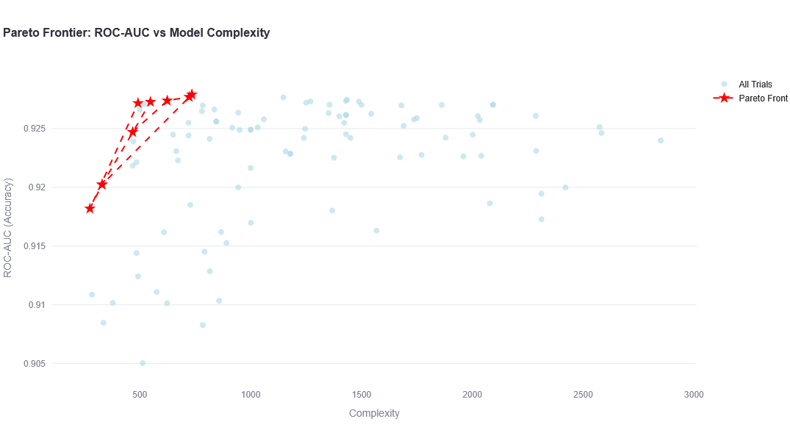

# Optuna Hyperparameter Optimization Demos



This repository contains demonstrations of using [Optuna](https://optuna.readthedocs.io/en/stable/index.html) for hyperparameter tuning with XGBoost on the UCI Adult Income dataset.

## Overview

The demos showcase:
1. **Single-Objective Optimization**: Optimizing XGBoost hyperparameters to maximize classification accuracy
2. **Multi-Objective Optimization**: Finding optimal trade-offs between classification accuracy and model complexity (number of trees)

## Installation

### Prerequisites

- Python 3.8 or higher
- pip

### Setup

1. Clone the repository:
```bash
git clone https://github.com/amitsaha/optuna-demo.git
cd optuna-demo
```

2. Create a virtual environment 

Using conda:

```bash
conda create -n optuna-demo
```

Activate it:

```bash
conda activate optuna-demo
```

3. Install `pip`

```bash
conda install pip
```

4. Install dependencies:
```bash
pip install -r requirements.txt
```

## Usage

###  Single-Objective Optimization

```bash
cd single-objective
```

Standalone:

```bash
python single_objective_demo.py
```

Streamlit:

```bash
streamlit run streamlit_demo.py
```

Then open your browser to the URL displayed (typically http://localhost:8501).

#### Multi-Objective Optimization

```bash
cd multiple-objective
```

Standalone:

```bash
python multi_objective_demo.py
```

Streamlit:

```bash
streamlit run streamlit_demo.py
```

Then open your browser to the URL displayed (typically http://localhost:8501).


## Dataset

The demos use the **UCI Adult Income** dataset, which is automatically downloaded via the `ucimlrepo` package. This dataset contains census data and is used to predict whether an individual's income exceeds $50K/year based on various demographic features.

- **Features**: 14 (age, workclass, education, marital-status, occupation, etc.)
- **Target**: Binary classification (income >50K or ≤50K)
- **Samples**: ~48,000

## Hyperparameters Tuned

The following XGBoost hyperparameters are optimized:

- `max_depth`: Maximum tree depth
- `learning_rate`: Step size shrinkage
- `n_estimators`: Number of boosting rounds

## Key Concepts

### xgboost

Boosting as a team of trees:

1. max_depth: how smart each team member is.
2. n_estimators: how many team members you have.
3. learning_rate: how loudly each speaks when forming the final decision.

### Single-Objective Optimization

In single-objective optimization, we aim to maximize a single metric (accuracy). Optuna explores the hyperparameter space and finds the configuration that yields the best performance.

### Multi-Objective Optimization

In multi-objective optimization, we optimize for multiple competing objectives simultaneously:
1. **Maximize AUC-ROC**: Better predictive performance
2. **Minimize complexity**: Fewer trees means faster inference and simpler model ([Reference](https://xgboosting.com/xgboost-model-complexity/))

The result is a Pareto frontier - a set of solutions where improving one objective would require sacrificing another. This allows you to choose the best trade-off for your specific needs.

## License

This project is licensed under the Apache License 2.0 - see the [LICENSE](LICENSE) file for details.

## References

- [Optuna Documentation](https://optuna.readthedocs.io/en/stable/)
- [Optuna sampling algorithms](https://deepwiki.com/optuna/optuna/3-sampling-algorithms)
- [XGBoost Documentation](https://xgboost.readthedocs.io/)
- XGboost model complexity
  - https://xgboosting.com/xgboost-model-complexity/
  - https://codesignal.com/learn/courses/xgboost-for-beginners/lessons/controlling-complexity-and-learning-rate
- [UCI Adult Income Dataset](https://archive.ics.uci.edu/dataset/2/adult)
